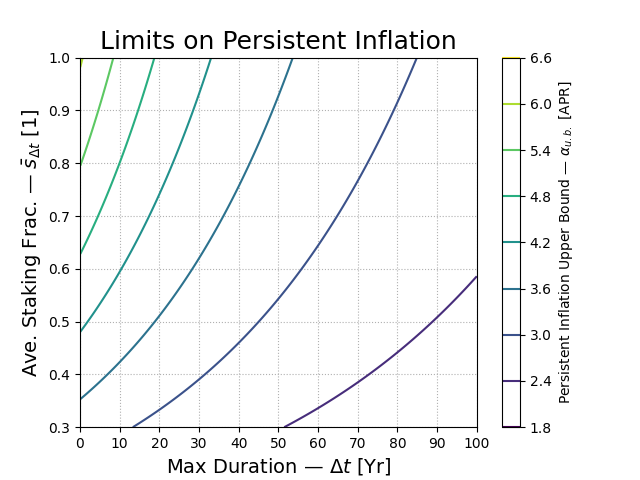

# Dynamical Systems for Ethereum

Some proof-of-stake blockchains, like [Stellar](https://stellar.org/),
target a fixed inflation rate.  We'll model that first to introduce
basics.  We then imagine a blockchain, "Phlogistoneum" with Ethereum's
issuance curve, but no burn, and investigate the inflation rate of
this imaginary chain.  Throughout we develop the basics of dynamical
systems and give some code examples you can play with.

This is not a tutorial, but we have tried to make it as accessible as
possible.  We believe dynamical systems and numerical suites like
`scipy` are the right tools for modeling Ethereum macoreconomics, and
the conversation would significantly benefit from their use.  When we
started this research, we actually did not set out to propose a new
model or contend/debate any of the conventional wisdom, we just
wanted to understand what the hell was going on.  We were led to
our model of Ethereum dynamics by the use of these tools.

## Pre-requisites

We use python code examples.  They are not strictly necessary but if
you want to understand/use them, you'll need basic facility with a
python prompt; we recommend [ipython/jupyter](https://ipython.org/).
The first few chapters of [this
book](https://www.amazon.com/Python-Data-Analysis-Wrangling-IPython/dp/1491957662/)
cover the background skills.

We assume familiarity with [calculus and highschool
algebra](https://www.amazon.com/Programmers-Introduction-Mathematics-Second/dp/B088N68LTJ/).
We introduce and motivate concepts from [dynamical
systems](https://youtube.com/playlist?list=PLbN57C5Zdl6j_qJA-pARJnKsmROzPnO9V&si=iN5YCipB_CeIfrbB)
and [approximation
theory](https://youtube.com/playlist?list=PL5EH0ZJ7V0jV7kMYvPcZ7F9oaf_YAlfbI&si=lFFFJIMAH6nE5BX1);
the first few videos of the linked lecture series, and a willingness
to look up unfamiliar terms, should prove helpful.  At the end of this
section we'll link to more advanced books.

## Constant Inflation

You probably have seen how to solve the following equation with constant
$k$ and blocktime $\tau_b$.

$$\displaystyle
x_{t+\tau_b}=x_t + kx_t
$$

This could approximate ($k>0,\tau_b\approx1$ year) the constant
inflation of currency supply $x$ of a blockchain with a fixed
inflation rate.  It might also describe ($k<0,\tau_b\approx30$ min)
the author's expected net worth $x$ every half-hour of an REI shopping
expedition.

The *fixed point* $$x^\star$$, corresponding to when $\Delta_t
x:=x_{t+1}-x_t=0$ is $x^\star=0$.  That fixed point is *stable* (a
sink) when small *perturbations* $x=x^\star+\epsilon$ shrink, and
*unstable* (a source) when they grow.  Here is some code, implementing
this system in `ethode` when $k$ is constant.

```python
from ethode import *
@dataclass
class ExpParams(FinDiffParams):
    k: 1/Yr = .01
@dataclass
class ExpSim(FinDiffSim):
    params:Params = field(default_factory = ExpParams)
    @staticmethod
    def func(t:Yr, v:ETH, p:Params) -> ETH/Yr:
        return p.k * v
```

So much code for such a simple equation!  For more complicated systems
though, the overhead works for us.

The condition for stability (perturbations grow) is $k>0$, and for
instability $k<0$.  (The special value $k=0$ corresponds to a *center*
fixed point, which are still conceptually important, but outside of
physics these are not considered candidates for equilibrum because any
noise whatsoever disrupts them.)

When the *units* of $$\tau$$ are "years", the constant $k/\tau_b$
corresponds to the APY at which $$x$$ inflates or blog post writers go
bankrupt; $x_t=x_0*(1+k)^{t/\tau_b}\approx
x_0+\frac{k}{\tau_b}x_0+\ldots$.  The smaller $$k$$ is compared to 1,
the more exact this approximation becomes.

You may have noticed that in defi nearly everything is quoted in terms
of APY.  What then are we to make of some ZOMG:FCKR liquidity pool on
[beefy.fi](htts://beefy.fi), promising 3000\% APY?  Such ludicrous
numbers, always self-denominated, are at best projections based on the
current $$\frac{\Delta_t x}{x_t}$$.  You may have had the experience
that such things often decrease over time.  So before getting too bent
out of shape about a rate of return or a rate of inflation, it is wise
to consider the global constraints on this quantity; how will $$k$$
change over time?

### Not-Constant Inflation

Consider a more realistic equation, in which the $$k(x,t,\ldots)$$ is
some unknown variable rate.  For simplicity just write $$\kappa:=kx$$, and
remember that $\kappa$ has a zero at $x=0$.

$$\displaystyle
x_{t+\tau_b}=x_t+\kappa(x_t,t,\tau_b,\ldots)
$$

```python
@dataclass
class VarExpParams(ExpParams):
    def kappa(self, x:ETH, **kwargs) -> ETH/Yr: pass
@dataclass
class VarExpSim(FinDiffSim):
    params:FinDiffParams = field(default_factory = VarExpParams)
    @staticmethod
    def func(t:Yr, x:ETH, p:Params) -> ETH/Yr:
        return p.kappa(t = t, x = x) * x
```

We have made explicit a dependence on $\tau_b$; see below.  Hopefully
it is clear that any point $x^\star=0$ where $\kappa(x^\star)$ is zero
are fixed points.  To asses local stabilty we add an $\epsilon$ as
small as we can $x_t=:x^\star+\epsilon_t$.  For $$\tau>0$$, the system
is stable when $$\epsilon_{t+\tau}<\epsilon_t$$; we need to asses the
sign of this difference:

$$\displaystyle
\frac{\epsilon_{t+\tau}-\epsilon_t}{\tau}=\frac{\kappa(x^\star+\epsilon_t)-\kappa(x^\star)}{\tau}~\overset{?}{<}~0.
$$

Recallng that $$\kappa(x^\star)=0$$, we find that the stability
condition for $\tau>0$ simplifies to something essentially the same as
before $k(\kappa^\star+\epsilon)<\kappa(x^\star)=0$.

When $$\kappa$$ is arbitrary it might jump around quite a bit in
response to small perturbations.  If we do not have enough details
about $\kappa$ to satisfy, time averaging over some
$\tau\gg\tau_{b}$ might help, otherwise there is not much more that
can be said at this level of generality.  However when $$k$$ seems to
vary smoothly we can hope to use calculus.  To dangerously abridge the
first year of calculus: "deltas become derivatives";
$$\Delta_tx\mapsto\frac{dx}{dt},
~\kappa\mapsto\lim_{\tau_b\to0}\frac{\kappa_\Delta(x,\tau_b,\ldots)}{\tau_b}=:\kappa$.

If this limiting business with kappa seems artificial, consider the
case that $x$ is a proof-of-stake cryptocurrency.  If the protocol
halved blocktime, this would change the staking APY qute a bit!  One
imagines core devs picking a target APY and interpolating to smaller
and smaller blocktimes... so $$\kappa(\tau,\ldots)$$ and whatever it
is, $\lim_{\tau_b\to0}\frac{\kappa_\Delta(x,\tau_b,\ldots)}{\tau_b}$
had better be finite.

Anyway. For the stability of a one-dimensional system, we just want to
know how small changes in $x$ will change things.  This is because, in
a one dimensional system everything else is held constant.  You can
probably guess the conditions for stability here:

$$\displaystyle
\boxed{
\begin{array}{rcl}
\frac{dx}{dt} := \dot{x} &=& \kappa(x)\\
\mathrm{Locally Stable iff} && \frac{\partial\kappa}{\partial x}<0
\end{array}
}$$

Here $$\frac{\partial\kappa}{\partial x}$$ plays exactly the same role
that $$k$$ did earlier.  This similarity is no accident; perturbations
of one-dimensional systems in which the $$\epslion$-term of the
expansion of $\kappa$ is not forced to be zero, act like exponential
growth/decay, at least initially.

### A Phlogistoneum Phairy Tale

Let's make this more concrete.  Consider a proof-of-stake
cryptocurrency "Phlogistoneum" with total issued currency $$P$$ of
which an amount $$S$$ participating in consensus.  Perhaps
validators are chosen via popularity contest, or they compete for
spots in an auction to buy the core devs lambos; anyway at least for
now $$0<s=S/P$$ is *fixed*; $$\dot{s}=0$$.

Phlogistoneum's devs are incredibly lazy so naturally they copy
Ethereum's blocktime and present-day issuance curve
$$y(S)=y_1/\sqrt{S}$$, where $$y_1$$ is constant.  So:

$$\displaystyle
\dot{P}=y(S)S = y_1\sqrt{s/P}\cdot P
$$

The only fixed point for Phlogistoneum supply occurs basically at or
just-before the genesis block.  Is it stable or unstable?  If
$$\dot{x}/x=+k$$ above corresponds to a constant inflation rate, what
then does $$\dot{P}/P=k\sqrt{P}\ll P$$ correspond to?  Depsite the
lack of a burn, which the devs were much to lazy to bother
implementing, the inflation rate of Phlogistoneum supply is
ever-decreasing; simply take the partial derivative
$\partial\dot{P}/\partial{P}=-y_1\sqrt{s/P}/2$.

If Phlogistoneum smart contracts can support even a very small postive
APY for users in real terms, wether through money laundering or
mattress sales, the valuation of their currency supply should
eventually stabilize.  But can they survive the initial - intermediate
period of high inflation?  This is a dynamics question!

When $$\kappa$$ is a constant, this reduces to our previous constant
exponential growth.  Generally we will *not* assume that variables are
constant, and if we do it will be explicit.  So when in doubt,
mentally substitute $$a(x,y,z,\ldots)$$ for $$a$$, generally.  We do
this because we very rarely *know* the "real" equations if such even
exist; at best we *model* systems... and as we'll see with EIP 1559,
even when we *do* know something specific, what we know might just
average out over timescales of interest!  Perhaps surprisingly, we can
still come to conclusions about these systems.

### Issuance and Inflation

Much depends on how accurate our approximation for issuance $I\approx
yS$ is.

#### Issuance in Annotated Spec

The total revenue in block $t$ for a validator $i$ can be usefully
split into the “base reward”, yield due to spot issuance of new ether
$I^\bullet_i(t)$, and “other” $F^\bullet_i(t)$ including priority
fees, block proposer fees, etc.  The latter do not contribute to
issuance of new ether, but the base reward does.  The yield due to
issuance is given in Vitalik Buterin’s [annotated specification](
https://github.com/ethereum/annotated-spec/blob/98c63ebcdfee6435e8b2a76e1fca8549722f6336/phase0/beacon-chain.md#rewards-and-penalties-1)

```python
def get_base_reward(state: BeaconState, index: ValidatorIndex) -> Gwei:
    total_balance = get_total_active_balance(state)
    effective_balance = state.validators[index].effective_balance
    return Gwei(effective_balance * BASE_REWARD_FACTOR // integer_squareroot(total_balance) // BASE_REWARDS_PER_EPOCH)
```

(This spec is several years out of date, except the yield curve and
issuance essentials have not been touched, so we *believe* this is a
decent guide.)

Here `total_balance`is the sum of all balances of active validators
$S^\bullet=\sum_iS^\bullet_i$ as we can see here:

```python
def get_total_active_balance(state: BeaconState) -> Gwei:
    """
    Return the combined effective balance of the active validators.
    Note: ``get_total_balance`` returns ``EFFECTIVE_BALANCE_INCREMENT`` Gwei minimum to avoid divisions by zero.
    """
    return get_total_balance(state, set(get_active_validator_indices(state, get_current_epoch(state))))
#...
def get_total_balance(state: BeaconState, indices: Set[ValidatorIndex]) -> Gwei:
    """
    Return the combined effective balance of the ``indices``.
    ``EFFECTIVE_BALANCE_INCREMENT`` Gwei minimum to avoid divisions by zero.
    Math safe up to ~10B ETH, after which this overflows uint64.
    """
    return Gwei(max(EFFECTIVE_BALANCE_INCREMENT, sum([state.validators[index].effective_balance for index in indices])))
#...
def get_active_validator_indices(state: BeaconState, epoch: Epoch) -> Sequence[ValidatorIndex]:
    """
    Return the sequence of active validator indices at ``epoch``.
    """
    return [ValidatorIndex(i) for i, v in enumerate(state.validators) if is_active_validator(v, epoch)]
#...
def is_active_validator(validator: Validator, epoch: Epoch) -> bool:
    """
    Check if ``validator`` is active.
    """
    return validator.activation_epoch <= epoch < validator.exit_epoch
```

So we can estimate validator $i$’s share of issuance to the nearest
gwei at block $t$ as
$I^\bullet_i(t)=y_0(1)S^\bullet_i(t)/\sqrt{S^\bullet(t)}$ where
$y_0(1)$ is the amount of ETH that would be issued per year were a
total of 1 Ether staked; see below.

What about for the system as a whole?  Similarly, we sum up each
contribution $I^\bullet:=\sum_iI^\bullet_i$ obtaining
$I^\bullet(t)=y_0(1)\sqrt{S^\bullet(t)}=y^\bullet(S^\bullet)\cdot
S^\bullet$, expressed using an *issuance yield curve*
$y^\bullet(S^\bullet)=y_0(1)/\sqrt{S^\bullet}$.

The calculation of the constant $y_0(1)$ can be found in Ben
Eddington's [Eth2.0 Book](
https://eth2book.info/capella/part2/incentives/issuance/).  He
approximates in terms of $N$ the number of validators (940.87
ETH)$\sqrt{N}$/yr.  Like Eddington we will assume 32 ETH per validator
obtaining $\boxed{y_0(1)\approx166.3/\mathrm{yr}}$.  

#### Inflation

### Inflation

Inflation is used to refer to many things, but here we mean
specifically the quarterly fractional change in accessible Ether.
Consider $$\alpha:=\dot{A}/A\approx(I-B-J)/A$$ in light of the [above
table](#table-of-flows).   In general and under
the existing yield curve we have (where $$\beta=bf=B/U$$):[^noburn]

$$\displaystyle
\alpha\ \approx\ y(sA)s-\beta(1-s)-\jmath s \ =\ y_0(1)\sqrt{s/A}-\beta(1-s)-\jmath s
$$

You can explore this by adding `alpha(), sfrac()` as `@output` methods

```python
@dataclass
class SUaConstParams(SUConstParams):
    @output
    def sfrac(self, S:ETH, U:ETH) -> One:
        return S / (S + U)
    @output
    def alpha(self, S:ETH, U:ETH) -> 1/Yr:
        s = self.sfrac(S,U)
        return self.yld(S) * s - self.b * self.f * (1 - s) - self.j * s
@dataclass
class SUaConstSim(SUConstSim):
    params: Params = field(default_factory = SUaConstParams)
su_a = SUaConstSim()
su_a.sim()
```

#### How Long can Inflation Last?

There are concerns that increased staking could lead to inflation.
Inflation is the log change in supply growth
$\alpha:=\frac{d\log{A}}{dt}=\dot{A}/A$.  Here we obtain a
timescale-sensitive upper bound on $\tau$-averaged issuance and
therefore inflation.

The only term contributing to supply is issuance $I$, and the only
loss terms are burn $B$ and slashing $J$.

$$
\dot{A}=I-B-J
$$

Unlike $B,J$ issuance $I$ is a known function of the spot issuance
yield curve $y^\bullet$ which is a function of spot staked ETH
$S^\bullet$.

$$\displaystyle
\begin{array}{rcl}
I &:=& \frac{1}{\tau}\int_{t-\tau}^t y^\bullet(S^\bullet) S^\bullet dt'
I_0 &=& \frac{1}{\tau}\int_{t-\tau}^t y_0(1)\sqrt{S^\bullet} dt'
$$

In the [blog post](https://blog.20squares.xyz/issuance-dynamics/) we
used an inequality using the covariance obtaining $I\leq yS$, where
the variables without bullets are $\tau$-averaged.  Here we'll apply
[Jensen's
inequality](https://en.wikipedia.org/wiki/Jensen%27s_inequality) twice
to obtain an upper bound on which is useful for quantitative
calculations.  Specifically we'll use the time average of a square
root is bounded above by the square root of the time average, and the
staking fraction $s=S/A$.

$$\displaystyle
\begin{array}{rcl}
dA = (I_0-B-J)dt &\leq& I_0dt = \left[\frac{1}{\tau}\int_{t-\tau}^t y_0(1)\sqrt{S^\bullet} dt'\right]dt\\
dA &\leq& \left(\frac{1}{\tau}\int_{t-\tau}^t y_0(1)S^\bullet dt'\right)^{1/2} dt = y_0(1)\sqrt{S}dt\\
\int_{t}^{t+\Delta t} A^{-1/2}dA &\leq& y_0(1)\int_t^{t+\Delta}\sqrt{s}dt'\\
\frac{1}{2}\left(\sqrt{A(t+\Delta t)}-\sqrt{A(t)}\right)
&\leq& y_0(1)\Delta t(\bar{s}_{\Delta t})^{1/2}
\end{array}
$$

Here $\bar{s}_{\Delta t}$ is staking fraction averaged over the interval
$(t,t+\Delta t)$.  Now, let us suppose that for some unspecified
reason, supply grows exponentially over the same interval;
$A(t+\Delta t)=A(t)e^{\alpha\Delta t}$; how long can it maintain this?

$$\displaystyle
\alpha\leq \alpha_{u.b.}(\Delta t) = \frac{2}{\Delta t}\log\left(
1 + 2y_0(1)\Delta t \sqrt{\bar{s}_{\Delta t}/A(t)}\right)
$$

Using the Jan 2025 supply value $A(t)\approx120.4\times10^6$ETH and
$y_0(1)\approx166.3$/yr we obtain the following bounds on just how bad
inflation could get.  Much tighter bounds are possible under very
reasonable economic assumptions (we are entirely neglecting burn), but these
are gauranteed by the power of math alone.



So not great, but not catastrophic either.

```python
from numpy import sqrt, log, linspace, meshgrid
def alpha_ub(delt:Yr, save:One = .3,
             Anow:ETH = 120.4e6, y1:1/Yr = 166.3) -> 1/Yr:
    return (2 / delt) * log(1 + 2 * y1 * delt * sqrt(save / Anow))
tvs = np.meshgrid(np.linspace(1/12,100,1000), np.linspace(.3,1,1000))
a = alpha_ub(tvs[0], tvs[1])

import matplotlib.pyplot as plt
fig, ax = plt.subplots()
cntr = ax.contour(tvs[0], tvs[1], 100 * a)
cbar = fig.colorbar(cntr)
cbar.set_label(r'Persistent Inflation Upper Bound — $\alpha_{u.b.}$ [APR]')
plt.xticks(np.arange(0,101, step=10))
plt.grid(True, linestyle=':')
plt.xlabel(r'Max Duration — $\Delta t$ [Yr]', size=14)
plt.ylabel(r'Ave. Staking Frac. — $\bar{s}_{\Delta{t}}$ [1]', size=14)
plt.title('Limits on Persistent Inflation', size=18)
plt.show()
```

### More Mathematics for People Who Care

If you have taken analysis and are curious what is going on.  Our
dynamical variables $\vec{x}$ will always take real values
$\vec{x}\in\mathbb{R}^d$, fixed points are the points $X^*$ of
potential equilibrium where the derivatives are equal to zero
$\dot{X}=0$.

Only the global stable fixed points should be considered valid market
equilibria.  The easiest method to classify stability is local
stability.  If a point is locally stable it is globally stable.  Local
stability is assessed on wether perturbations
$x=\vec{x}^*+\vec{\epsilon}$ generally grow (unstable) or shrink
(stable), but for higher dimensional systems it is not sufficient to
look at each one dimensional map alone.

Fixed points can be moved around by varying parameters, and even
joined or split, via bifurcations.  However the winding number, which
measures the amount of divergence or convergence of nearby paths, in
any sufficiently large region (technically ”open ball”) containing he
relevant collection of such fixed points, cannot change.  "Relevant"
here means the ones that will merge, or have separated.

As an immediate consequence of this, if a new fixed point is
introduced by varying a parameter, it must first pop into existence as
a center point, with winding number 0.  Such fixed-points are for
instance stable from the left and unstable to the right: an open ball
measures no sinks or sources: all paths entering the region,
eventually leave, etc. As is common in dynamical systems outside of
physics, we do not believe dynamics including center-points model real
economic systems.  The reason is that these are not structurally
stable to noise: the center point disappears or splits into a source
and a sink. We require any economic model to be stable to noise.
Since we further reduce all models in this paper to low-dimensional
systems, $d$ = 1 and 2, when classifying fixed points we are
considering as potential equilibria, by the real parts of their
eigenvalues $\lambda$, there are really only two options:

- stable — $Re(\lambda)<0$ AKA sinks, attractors: close trajectories approach, and
- unstable — $Re(\lambda)>0$ AKA sources, repellors: close trajectories diverge

We have mentioned center points $Re(\lambda)=0$ because their
introduction via the Saddle-Node bifurcation represents a kind of
“intervention” in a system, and could play an important role in
planning the future of Ethereum Issuance.  We have included a section
on criteria based on this approach, and hope to have more concrete
results for the Final Report.

Highly Recommended books in order of increasing difficulty and sophistication if you want to understand this stuff:

- Kun (2020)
[A Programmer’s Introduction to Mathematics](https://www.amazon.com/Programmers-Introduction-Mathematics-Second/dp/B088N68LTJ/)
- Strogatz (2024) [Nonlinear Dynamics and Chaos](https://www.amazon.com/Nonlinear-Dynamics-Chaos-Steven-Strogatz/dp/0367026503/)
- Hirsch, Smale and Devaney (2003) [Differential Equations …](https://www.amazon.com/Differential-Equations-Dynamical-Introduction-Mathematics/dp/0123497035/)
- Bender and Orszag (1997) [Advanced Mathematical Methods for Scientists and Engineers](https://www.amazon.com/Advanced-Mathematical-Methods-Scientists-Engineers/dp/0387989315/)
- Arnol’d (Ed.) the *Dynamical Systems* Series, esp. V (1994) [Bifurcation and Catastrophe](https://www.amazon.com/Dynamical-Systems-Bifurcation-Encyclopaedia-Mathematical/dp/0387181733/)

# Macroeconomics Model

We make the following assumptions about Ethereum so that our models
describe reality, and we can model issuance policy using differential
equations, so called "stock and flow" models.

## Stocks

At time $$t$$ all Ether (ETH) ever issued $$E(t)$$ is comprised of
these buckets:

$$\displaystyle
E := S + C + \cancel{O} + Q_+ + Q_-
$$

Where:
* $E$ — Total Ether in existence
* $S$ — Staked ETH participating in consensus ($$D$$ is [commonly used]()) as per Shanghai hard-fork.
    	-- Including staked ETH in LSTs, which we denote by $L\leq S$.
* $C$ — Unstaked Circulating Ether (sometimes $$S$$ [is used]() for ths "supply")
       ; ETH which is liquid and locked in non-staking smart contracts. 
* $\cancel{O}$ — Burned Ether; the balance of `0x00..0` and lost private keys, etc.
* $Q_\pm$ — Ether in the staking and unstaking queues

If we use a lower-case variable of the same name it will be a natural
dimensionless fraction of the original; $$s=S/A$$ etc.  If the
names/symbols bother you, please [read the alt doc]().

Also of importance will be several derived quantities.

* $A:=S+C$ - Accessible Ether
* $s := S/A$ - Staked Fraction
* $\ell:=L/S$ - The fraction $$\ell$$ of all staked ether in LSTs $$L$$

Above and in what follows we usually suppress the dependence of various
functions on their variables; $f$ instead of $f(S,C,\ldots)$.  We
only write for instance $y(S)$ when we want to emphasize that knowing
$S$ alone and some protocol constants is sufficient to compute $y$.
We never assume anything is constant without explicitly saying so.
Values of variables at a specified fixed point are denoted by
$S^\star$ and $f^\star:=f(S^\star,C^\star,\ldots)$.

## Quarterly Averages

When we average over stocks and flows on quarterly time-scales (3
months), we are assuming that discrete effects like the (un)staking
queue transit time, reward queue lag, the minimum 32 ETH required to
stake a validator, and fluctuations in blocktime, etc... all these
things contribute “subleading” terms which do not alter the
qualitative features of our results.

Every fraction etc. such as $$s=S/A$$ is thus defined in terms of the
quarterly averages.  When we want to *emphasize* that an
externally-defned quantity $$y$$ has been averaged we'll use
$$\bar{y}$$.  One technical point concerns products, which we postpone
to our discussson of issuance, below.

## Big Picture

We average over the withdrawal, staking, and unstaking queues to
arrive at the conceptual picture in [figure 1]()

$$
\displaystyle
\begin{array}{rcl}
\dot{E} &=& I\\
\dot{A} &=& I-B-J\\
\dot{S} &=& R+Q_+-Q_--J\\
\dot{C} &:=& \dot{A}-\dot{S}\\
\dot{\cancel{O}} &:=& \dot{E}-\dot{A}
\end{array}
$$

Where all quantities are averaged quarterly, and non-negative as stated:
* $$I$$: Total Issuance in a certain quarter
* $$B$$: Qrtly. Ether burned as per EIP 1559, etc.
* $$J$$: Qrtly. Ether slashed due to penalized behavior
* $$R$$: Reinvestment of net rewards by existing validators
* $$Q_+-Q_-$$: Net Qtrly. ave. (un)staking queue flows
  -- $$Q_-$$: Unstaking: validators leaving the protocol
  -- $$Q_+$$: New staking: validators not counted in $$R$$

Briefly, vaidator rewards add to circulating (unstaked, unbured) ether
$$\dot{C}^{val}=I+F$$, and transaction fees remove circulating ether;
$$\dot{C}^{tx}=-F-B$$.  Some amount of net rewards $$R<I+F-J$$ are
reinvested by staking businesses;
$$\dot{C}^{rnvst}=-R;~\dot{S}^{rnvst}=+R$$; for LSTs this is
automatic.  Finally, net staking reduces circulating ether and
increases staked ether
$$\dot{C}^{queues}=-(Q_+-Q_-)/\tau;~\dot{S}^{queues}=+(Q_+-Q_-)/\tau$$.  All
accessible ether increases or decreases based on the balance of
issuance minus burn $$\doT{A}=I-B$$.  These quantities obey the
following relationships:

* $$Y = I+F$$ - total validator yield consists of issuance and priority fees
* $$0< R\leq Y;~~r:=R/Y$$ - reward reinvestment is a ratio
* $$0<B\leq F+B;~~b:=B/(F+B)$$ - base fee is a fraction of total transaction fees
* $$0<F+B+Q_+\leq C$$
  -- $$f:=(F+B)/C$$ - total transaction fees cannot exceed circulating ether
  -- $$q_+:=Q_+/C$$ - nor can new new staking
* $$0\leq Q_-\leq S;~~q_-:=Q_-/S$$ - unstaking cannot exceed total staked ether.
* $$0\leq L\leq S;~~\ell:=L/S$$ - LSTs are some fraction of staked Ether.
* $$\alpha:\dot{A}/A$$ - in/de-flation can take any sign.

From these considerations we derive an endogenous $$(S,A)$$-system,
and show you ou might simulate it.  In our next post, we transform
into an $$(s,\alpha)$$-system and focus on a restricted regime similar
to current market conditions, in which $$\|\dot{alpha}|\ll|\dot{s}|$$.
In our third blog post we will study a parametrization of the
$$(L,S)$$ system.

## Flows

### Total Ether $$\dot{E}$$ and Issuance

Ethereum is Proof-of-Stake with a protocol-level issuance yield curve.
The existing yield curve, post-Shanghai hardfork, $y_0(S)=k/\sqrt{S}$
determines issuance of new Ether.

The total revenue in the block at time $t$ for a validator indexed by $i$ can be
usefully split into the “base reward”, yield due to issuance of new
ether $I_i(t)$, and “other” $F_i(t)$ including priority fees, block
proposer fees, etc.  The yield due to issuance is given in the
[annotated
specification](https://github.com/ethereum/annotated-spec/blob/98c63ebcdfee6435e8b2a76e1fca8549722f6336/phase0/beacon-chain.md#rewards-and-penalties-1)
as

```python
def get_base_reward(state: BeaconState, index: ValidatorIndex) -> Gwei:
    total_balance = get_total_active_balance(state)
    effective_balance = state.validators[index].effective_balance
    return Gwei(effective_balance * BASE_REWARD_FACTOR // integer_squareroot(total_balance) // BASE_REWARDS_PER_EPOCH)
```

So, if `total_balance` is the sum of all effective
balances, $S:=\sum_iS_i$ we can estimate validator $i$’s share of
issuance to the nearest gwei at block $t$ as

$I_i(t)=kS_i(t)/\sqrt{S(t)}$

where $k$ is the ratio `BASE_REWARD_FACTOR / BASE_REWARDS_PER_EPOCH`.

What about for the system as a whole?  Similarly, we sum up each
contribution $I:=\sum_iI_i$ obtaining
$I(t)=kS(t)/\sqrt{S(t)}=k\sqrt{S(t)}$.  This can be expressed using a
yield curve $y(S)=k/\sqrt{S}$, giving for spot values $I=y(S)S$.

#### Separation of Timescales

A technical complication introduced by time averaging comes when we
must interact with "bottom up" quantities that we do not have the
liberty to define ourseles.  This occurs with issuance $$I=yS$$ and
pretty much any manipulations involving the yield curve and quarterly
averages.

In this section alone, we will use $$I$$ to refer to the
spot issuance, $$\bar{I}$$ the quarterly average:
$$\bar{I(t)}=\frac{1}{\tau}\int_{t-\tau}^t I(t')dt'$$.

To use this average as our dynamical variable, we split 
$$I=\bar{I}+\tilde{I}$$ into a slowly varying $$\bar{I}$$ and the
faster varying deviation from that average, defined as
$$\tilde{I}:=I-\bar{I}$$.  Some useful facts we will use.

* Don't let the integrals confuse you, the product rule is still valid:
  $$\frac{d}{dt}(\bar{y}\bar{S})=\dot{\bar{y}}\bar{S}+\bar{y}\dot{\bar{S}}$$
* The fast-varying quantity $$\tilde{I}$$ by definition has zero mean
  $$\int_{t-\tau}^t\tilde{I}(t')dt'=0$$
* Because of this, we can expand products of spot quantities $$I=yS$$ into
  the product of averages and a covariance term;
  all cross terms are zero by construction:
  $$I = yS = \bar{y}\bar{S}+\frac{1}{\tau}\int_{t-\tau}^t(y-\bar{y})(S-\bar{S})dt'$$
* Because $$\frac{dy}{dS}<0$$ for all curves under consideration, this
  covariance term is negative.

So *back in the terminology of the rest of the post* the biggest takeaway is

$$\displaystyle
\dot{E} = I \approx yS - \kappa \leq yS
$$

Where $$\kappa$$ is the covariance term.  These considerations will
not play a critical role in our analysis, but are important if for
some strange reason the reader wants to connect the symbols on your
screen to actual reality.

### The Burn

Ethereum is a blockchain; participants submit transactions to
validators for inclusion in sequentially ordered blocks.  Previously
the mechanism for this was essentially an auction: participants bid
higher fees for more valuable blockspace, such as during big price
changes.  In an effort to ameliorate this, [EIP
1559](https://ethereum.github.io/abm1559/notebooks/eip1559.html).
split transaction fees into base and priority fees, with the base fee
"burnt" (destroyed forever).  The base fees is determined dynamically
by the amount of block congestion, using gas price as proxy.  The idea
is that traders can still compete for priority in blocks but they must
pay a deflationary penalty when "excessive" competition for blockspace
occurs.  This makes EIP 1559 a great example of a "bottom up"
dynamical system: the equaton is known, and we can directly analyze it
to see what happens.

$$\displaystyle
\beta_{t+\tau_b} = \max\left(\beta_{max},\ 
\begin{cases}
\beta_t + \frac{1}{8}\left(\frac{g_t}{g^\star}-1\right)\beta_t & g_t > g^\star
\\
\beta_t & g_t\leq g^\star
\end{cases}\right)
$$

Where:
- $\beta_t$$ is the base fee in Gas/Tx for the block minted at $t$
- $\beta_{t+\tau_b}$ is the base fee at the next block, where
- $\tau_b$ is the blocktime.
- $\beta_{max}$ lost out to VHS, also the maximum gas per block.
- $g_t$$ is the gas price in Ether/Gas for the block at $$t$$, and
- $g^\star$ is the target gas price, same unit.

For brevity we will often drop writing the explicit dependence on
block; $$\Delta\beta=(\frac{g}{g^\star}-1)\beta$$.

Right now this system is exogenous: it depends on gas price, which is
not currently a "dynamical variable"; $g_{t+1}-g_t$ appears nowhere!
To really study this system we would need an equation describing how gas
price could change in response to itself and base fee.  That is, we
want an endogenous system, depending only on internal variables and
known external forcings.  This requires a different kind of thinking,
a "top down" approach, in which we use macroeconomic arguments and
observations about the protocol etc. to guess at some $$\Delta =
\mu(g,\beta)$$.

The empirical data on burned Ether is shown in Figure 2
[here](https://decentralizedthoughts.github.io/2022-03-10-eip1559/);
the dynamics are very bursty over short timescales, suggesting that
$$(\beta_0,g^\star)$$ is a locally-unstable fixed point.  Moreover,
the dynamics is strikingly periodic.  We claim that a sufficient
condition for instabiliy of the $$(\beta_0,g^\star)$$ fixed point is
that $$\Delta\mu/\Delta g > 0$$,
e.g. $$\mu(g^\star+\epsilon,\beta^\star)>\mu(g^\star,\beta^\star)$$
for any small $$\epsilon>0$$.  Readers interested in understanding
this claim should watch the first few Strogatz lectures, model the
system as a two-dimensional map, and find a condition for at least one
eigenvalue to be positive.  The positive eigenvalue should determine
the timescale governing these blow-ups, allowing us to back out
information about $$\mu$$.

For policy questions, we are less concerned with the (admittedly
interesting) details of these dynamics, though.  We will just average
quarterly and call the whole thing $$B$$!

$$\displaystyle
B := \frac{1}{\tau}\int_{t-\tau}^t n(t')g(t')\beta(t')dt'
$$

If the use of an integral concerns you, think of $$\beta(t)$$ as a
*delta comb* $$\beta=\sum_{j=0}^t\beta_{t+j\tau_b}$$, where each pip
on the comb holds the value of the base fee at the corresponding
block.

### Priority Fees and MEV

We just talked about the base fee.  The priority fee is the other
component of transaction fees.  In particular this matters because
while base fee is burned, priority fees go to validators.  Keeping
that in mind, we also wish to include value extracted from the market
via the ordering of transactons in a block, so-called Miner
Extractable Value (MEV).

Here we really must embrace the "top down" approach. While the maximum
gas per block has mostly been reached every block post-Merge, when you
include MEV, an appropriate upper bound is entirely unclear, at least
to us.  However, we can make a few observations

* Burn cannot exceed total tx fees + MEV.  $$b:=B/(B+F)$$
* Tot. tx fees cannot exceed the circulating supply $$f:=(F+B)/C$$

Both of these fractions are strictlly positive, and (a reminder)
defined as ratios of quarterly averages.  We will use these below to
make an important observation about inflation at very long times.

### Inflation

We have just covered the two mechanisms by which Ether is created
(issuance) and destroyed (burn), including context on tx fees.  We are
now ready to talk about the change in total accessible ether $$A$$

$$\displaystyle
\dot{A} = I - B
$$

The inflation rate of a currency is the time change in the log supply
of\ that currency, [as per standard economic
definitions](https://www.albany.edu/~bd445/Economics_301_Intermediate_Macroeconomics_Slides_Spring_2014/Growth-Rate_Mathematics_(Print).pdf);
for our quarterly accessible ether that is
$$\alpha:=\dot{A}/A=\frac{d\log A}{dt}$$.  We can express this using
the staking fraction and the fractions from the previous section.

$$\displaystyle
\alpha = \bar{y}s - bf(1-s) - \kappa_{y,S}/A
$$

Where $$\bar{y}$$ is a reminder that we have taken a spot quantity
$$y$$ and quarterly averaged it.  This useful and innocent formula
already has some important things to say about the far future of
Ethereum.  Consider for instance, the current yield curve
$$y=k/\sqrt{S}$$.  There is an "effective supply value" $$S_y$$
inverting the curve $$S_y:=(\bar{y}/k)^2$$ which on average is
positively correlated with the true supply; $$S_y\sim S$$.

So, the *only positive term* $$\bar{y}s=ks/S_y\sim k/A$$ shrinks as
staked ether increases. Ethereum cannot sustain an average positive
inflation rate at very long times.  If you want to see this more
simply but less rigorously, neglect the burn entirely and aolve or
aimulate he behavior of $$\dot{S}=k\sqrt{S}$$, corresponding to n
burn, 100% reinvestment.  Not the long term behavior is less than every
positive exponential at long times $$S(t)\sim t^p\ll exp^{+at}$$, so supply
eventually grows more slowly than any exponential rate.

Ethereum may have periods of inflation, it could even return to them
periodically through inflationary/deflationary cycles, or it could
glide-path to zero.  Regardless, under the existing curve, we should
not expect a fixed positive inflation rate at very long times.
Instead, $$t\in\infty$$ Ethereum appears to be a fundamentally
deflationary commodity.  Note this does not mean inflation could not
reach excessive levels at intermediate timescales; we will return to
this question in our next post.

### Reinvestment

En masse, validators withdraw their rewards $$I+F$$ into circulating
ETH.  They reinvest some amount of rewards $$R$$ into staking more
validators.  Reinvestment into one's business is a natural practice,
and we expect $$R$$ to respond meaningfully to macroeconomic forces.
Reinvestment is also a part of every LST smart contract; via rebaisng,
a certain fraction of yield is the value proposition for the
token-holder; so any model with LSTs must include non-zero
reinvestment.  Again we define a variable fraction $$r:=R/(I+F)$$
which obeys $$0<r\leq1$$.

A diversity of validator behavior still permits a single value of
$$r$$ at a given time.  Reinvestment $$r$$ is the expectation value
$$\frac{1}{S}\sum_iS_ir_i$$; an average over each validator type
$$i$$, weighted by the amount of Ether each stakes. For LSPs
$$r_{LST}$$ is bounded below by the ratio of token yield to total
yield, and we can use this to roughly estimate some full $$r$$ values.
We will return to ths matter in our third post, but essentially at
long times, $$r$$ should approach the highest sustainable reinvestment
ratio that the market can bear, which likely corresponds to that of
the largest LST.  This "winner take all" dynamics is one of the
concerns motivating the proposed changes to issuance curves.

## The $(A,S)$ model

Altogether then, we have an endogenous dynamical system in which all of the
coefficients are (not necessarily constant) fractions.

$$\dislaystyle
\begin{array}
\dot{A} &=& yS-bf(A-S)\\
\dot{S} &=& r(yS+(1-b)f(A-S))+q_+(A-S)-q_-S
\end{array}
$$

### Test Drive

There is a practical shortcming of the above model that makes analyses
somewhat trickier.  [A 2021
anlysis](https://ethresear.ch/t/circulating-supply-equilibrium-for-ethereum-and-minimum-viable-issuance-during-the-proof-of-stake-era/10954)
by Elowsson exploring some of the same issues illustrates this point
nicely.  (Using the subscript $$E$$ for Elowsson; his variable names
are in terms of ours: $$D_E=S,~ S_E=A,~ b_E=bf(1-s)$$.)

First, we must be careful in the $$s\to1$$ limit; this has the burn
disappearing entirely, which is impossible if Ethereum is still
operating.  This is rectified by recognizing when we are talking about
"100% sakking" we really mean "99.9999..% staking"; even if the only
unstaked ether is hanging out in the rewards queue, and is immediately
spent on tx fees, this should still count toward $$C$$, not $$S$$.  We
recommend using $$s=1-\epsilon$$, and if you then get stuck in some
calculation, then make an expansion in powers of $$\epsilon$$,
and discard $$\epsilon^2$$, etc.

The real problem comes in looking for fixed points.  Following
Elowsson, lets do some algebra on $$0=\dot{A}=yS-bf(A-S)$$, using
$$y=y_0=k/\sqrt{S}$$.  Noting that whatever they may be, $$0<bf<1$$ so
if we assume $$s^\star<1$$ as Elowsson does, then we have
$$A^\star=\frac{(k^\star)^2s^\star}{b^\star f^\star(1-s^\star)^2}$$.
Is this a fixed point?  If it is, then
$$S^\star=s^\star{A}^\star=\left(\frac{k^\star{s}^\star}{b^\star{f}^\star(1-s^\star)}\right)^2$$.

The problem becomes apparent when looking at $$\dot{S}=0$$ and asking
the question "What happens if LSTs exist, but there is not signifcant
slashing or unstaking?  That is, when $$q_-+\jmath\approx0<r?"  It
certainly seems like a realistic (even desirable) possibility, yet we
find in such a case that $$\dot{S}>0$$ so long as $$S<A$$... there is
no realistic fixed point!  Could the math really telling us that so
long as LSTs exist ($r>0$) there is no equilibrium point without
appreciable slashing and/or unstaking?

Spoiler Warning!  At the risk of ruining your fun modelling or thinking
about this quandry, what is going on is that *we know* $$S\leq A$$
(e.g. $$s\leq1$$), but the *math doesn't*.  "Telling the math" about
this constraint involves looking at the quantity
$$\dot{s}=\frac{d}{dt}\left(\frac{S}{A}\right)$$.

In our next post, we will transform coordinates from $(A,S)$ to
$(\alpha,s)$, and study the system directly in terms of inflation and
staking fraction, quantities which have featured prominently in the debates
around Ethereum macroeconomics.

# PostScript: Variables Names and Terminology and Confusion

Using lowercase for dimensionless normalized quantities $$s=S/A$$, and
greek for their log time-derivatives $$\alpha=\dot{A}/A$$, combined
with the standard terminology ($$D$$ for "(staking) deposit") leads to
abominations like $$\frac{dd}{dt}$$ for the time-derivaive of staking
fraction (aka deposit ratio), or $$dX=DX/S$$ instead of the
differential of $$X$$.  Boo-hiss!  We use $$S$$ for (S)taked.

We use $$S$$ because $$T$$ is probably an even worse choice, and $$K$$
would mean that $$k$$ was staking fraction, instead of a curve
constant.  But... Very unfortunately $$S$$ is commonly used for what
we call "accessible" or circulating Ether (s)upply $$A$$.  One
confusing point is that for fiat "circulating [money
supply](https://www.investopedia.com/terms/m/moneysupply.asp)" refers
to M1: only liquid assets, and not M2, which includes things like
money market funds: things that take time to access.  Probably it is
best to consider some timescale and specify on which timescale the
circulating currency has a non-zero velocity of money. Nonetheless, we
stick with "circulating supply" because that is the dominant usage:
all tokesn that have been issued but not burnt.  Similarly, we try to
always say "issuance yield curve", because "yield curve" in common
parlance means something
[different](https://www.investopedia.com/terms/y/yieldcurve.asp), more
related to Compound and Aave than issuance... all that said economics
isn't great either, using $$\pi$$ for inflation, or $$\dot{Q}_+$$ to
mean the flow through $$Q_+$$ instead of the time-derivative of
$$Q_+$$!  Blech!!

## The Problem

The share of Ether staked by exchanges such as Coinbase and Liquid
Staking Providers (LSTs) such as Lido ("centralized" staking services)
[is considerable](https://dune.com/queries/2394100/3928083) continues
to grow.  This has provoked [concerns](https://issuance.wtf/), first
raised by Ethereum researchers, and which we share, that the future of
Ethereum might involve (1) all of its native asset being staked, such
that (2) the de facto currency is controlled by a confederation of
centralized entities wiith less transparent govrnance. In this blog
post we address the first of these concerns.

We use "stock and flow" differential equation models to study Ethereum
macroeconomics, specifically how changing issuance impacts these
questions.

0. Basics of applying Dynamics to Ethereum
1. Will reducing issuance avoid Runaway Staking?
2. Will reducing issuance avoid Governance Centralization?
3. Other Levers besides Issuance, and a means of evaluating levers.
4. Conclusions, tools to study and resolve policy debates.

Even if runaway staking does not directly concern you, it is
essential to understand our view of the interaction between inflation
and staking, a picture in tension with other research.

## Modelling Staking

Now some more details!

### Splitting Up A Growing Pie

Consider the quantity $$E$$ of all Ether in existence, averaged
qaurterly.  Let the issuance of new Ether as per The Merge be
quantified by $$I$$.  Then the change in time of total Ether is
$$\dot{E}:=dE/dt=I$$.

Now, let us separate $$E$$ into three smaller boxes;
$$S+C+\cancel{O}=E$$, representing (S)taked, (C)icrulating, and burnt
Ether $$\cancel{O}$$, respectively.  By considering each quantity a
quarterly average we can plausibly ignore the detailed dynamics of the
staking, unstaking, and withdrawal queues.

### How Pie is Pushed Around The Plate

This is our model:

$$
\displaystyle
\begin{array}{rcl}
\dot{E} &=& I\\
\dot{S} &=& R+Q_+-Q_-\\
\dot{A} &=& I-B\\
\end{array}
$$

Where all quantities are assesed quarterly:
* $$I$$: Total Issuance in a certain quarter
* $$R$$: Total Reinvestment of Validator Yields, in that quarter
* $$Q_\pm$$: Total (Un)Staking Queue Flows, in that quarter
* $$B$$: Total Base Fee (burn) assed, in that quarter.

Transaction fees $$F+B$$ are split into the base fee $$B$$ which is
burned, and priority fees plus MEV $$F$$ which go to validators via
the wihdrwal queue.  Fees obey the inequality $$0\leq F+B\leq C$$.  We
ae interested in the limit $$C\to0$$ and pull this dependence out by
defining $$f$$ such that $$fC = F+B$$. The fraction $$f$$ need not be
a constant, but whatever values it takes, $$f$$ must be a fraction:
$$0<f<1$$ with units of 1/year.  Looking at YCharts for 2024, an
average tx fee might be $$3\times10^{-4}$$ ETH, and with
$$\approx1.2\times10^6$$ transactions per day on a supply of 120M,
70\% of which is unstaked, corresponding to an $$f\approx.001$$/year.

En masse, validators withdraw their rewards $$I+F$$ into circulating
ETH.  They reinvest some amount of rewards $$R$$ into staking more
validators.  Reinvestment into one's business is a natural practice,
and we expect $$R$$ to respond meaningfully to macroeconomic forces.
Reinvestment is also a part of every LST smart contract; via rebaisng,
a certain fraction of yield is the value proposition for the
token-holder; so any model with LSTs must include reinvestment.  Again
we define a variable fraction $$r:=R/(I+F)$$ which obeys
$$0\leq{r}\leq1$$. As of Nov 23, 2024 the stETH token yield is
$$\approx3$$\%.  Over the same period, without MEV-Boost validator
yield is $$\approx4$$\%, and with MEV-Boost it is $$\approx5.7$$\%.
So probably, $$r$$ currently lies in the range $$.5\leq r\leq.75$$.

The quarterly flows from the staking and unstaking queues must obey
$$0\leq Q_+\leq C$$ and $$0\leq q_-\leq S$$, which we use below via
variable fractions $$q_+=Q_+/C,~q_-=Q_-/S$$.  Finally, we rewrite
$$\dot{S}$$ the change in total staked ETH, anticipating that we wish
to understand the relationship to inflation rate $$\dot{A}/A$$,
obtaining $$\dot{S} = r\dot{A} + r(B+F) + Q_+-Q_-$$.  For about the
past 6 months Ethereum supply has been growing pretty linearly,
corresponding to an inflation rate of about .5\%, that is
$$\alpha\approx.005$$/year.

The variable of primary interest is the staking fraction $$s=S/A$$;
recalling the quotient rule $$\dot{S}=\dot{S}/A-s\dot{A}/A$$ and
$$C=A-s$$, we obtain:

$$
\displaystyle
\dot{s} ~~ = ~~ \frac{\dot{A}}{A}(r-s) ~~ + ~~ (rf+q_+)(1-s) ~~ - ~~ q_-s
$$

The first term captures the effect of inflation/deflation.  Under
inflation $$\dot{A}/A>0$$, the staking fraction receives a boost when
it is less than reinvestment rate $$s<r$$, and a drag when $$s>r$$.
Under deflation $$\dot{A}/A<0$$ the effects are reversed, though see
below.  The second term combines new staking $$q_+$$ and the
reinvestment of priority fees and MEV $$rf$$, and is always
non-negative.  The third term represents unstaking and is always
non-positive.

### Equilibrium

#### Fixed Point

We now wish to study the fixed point $$s^\star$$ given by solving
$$0=\dot{s}=\frac{\dot{A}}{A}(r-s)+(rf+q_+)(1-s)-q_-s$$.  Recall from
our last post that since the Merge it seems
$$|\dot{\alpha}|\ll|\dot{s}|$$ and at medium timescales there is
support for a stable slowly changing value of $$\alpha^\star$$,
supporting a study of the fixed point $$x^\star$$ *given* a value for
$$\alpha^\star$$.


This yields the solution

$$s^\star = \frac{r^\star (\alpha^\star + f^\star) + {q_+}^\star}{
\alpha^\star + r^\star f^\star - {q_-}^\star}$$

We find that if $\dot{A}=0=\alpha$ (no inflation nor deflation) then
an interior market equilibrium $$s^\star<1$$ is impossible.  We reason
as follows.  In the absence of in/de-flation, an interior fixed point
$$s^\star<1$$ would require a persistent unstaking/capitulation of
existing validators $$q_->0$$.  This in turn either requires "churn",
a persistent supply of new validators to take their place
$$q_+^\star>0$$, or it is only a transient and $$q_-^\star\approx0$$;
recall that reinvestment by existing validators is not counted in
$$q_+$$.

Net unstaking $$q_->0$$ could only describe a market equilibrium if
one group of stakers was actively capitulating and withdrawing their
stake, while another group with a higher $$r$$ were aggressively
reinvesting in their business, and their reinvestment of fees and MEV
offset the unstaking, adjusted for inflation.  This cannot maintain
forever: eventually there will be no new Capitulators left, and
$$s^\star$$ must once again grow as required by the Reinvestors'
higher $$r$$, so $$s^\star$$ was not a fixed point at all.  Similarly,
at some point everyone who wants to stake should have staked.  If we
judge the quarterly fluxes due to the issuance of new humans and the
burn rate of legacy humans to be small and/or likely to take over
existing businesses, additional validators count overwhelmingly toward
$$r$$, so $$q_+^\star\approx0$$.  Thus, the fixed point $$s^\star$$
simplifies to

$$\displaystyle
s^\star ~~ = ~~ r^\star ~
\frac{\alpha^\star + f^\star}{\alpha^\star + r^\star f^\star}
$$

A calculation is illustrative under the current regime of positive
inflation.  If inflation dominates fees, $$\alpha\gg f$$ then
$$s^\star\sim r^\star<1$$, while if fees dominate inflaton $$\alpha\ll
f$$ and $$s^\star\to1$$.  For a numerical comparison, at present $$f
\approx .001<.005\approx\alpha$$ so to within 10\% error above,
$$s^\star\approx r$$ over the range of $$r$$ inferred from Lido yield
rate.

So if these conditions persist at long times, and to be clear there is
no reason to be certain they will, we should expect $$s^\star\approx
r\in(.55,.77)$$.  This places the lower range of $$s^\star$$ near the
50% staking target proposed by Elowsson.  This is hopeful!  However
ittle weight can be attached to such back-of-envelope extrapolations
as these.  To make reliable projections we need systematic measurement
of both the statistics of individual validator reinvestment and
metrics or at least surveys reflecting validator sentiment and
(in)capacity to absorb reduced revenue.

### Market Equilibrium: Stability

The fixed-point $$x^\star$$ represents "the" market equilibrium when it
is both unqiue and stable.

Non-uniqueness requires another solution to $$\dot{s}=0$$, thus a
shared and repeated root among all terms $$\alpha,rf+q_+,q_-$$.  That
is, each economic flow would have to nearly disappear at a particular
value of staking fraction.  Lacking any supporting data or a mechanism
for this, we cannot really analyse such an alternate equilibria, but
intuitively it seems unlikely, so for now we move on, assuming
uniqueness.

Stability requires that small perturbations shrink;
$$\left.\frac{\partial\dot{x}}{\partial x}\right|^\star<0$$, where
$$\left.\frac{d}{d\xi}\right|^\star$$ denotes a derivative with
respect to $$\xi$$ at the fixed point $$\xi^\star$$.  The full
stability condition is

$$\displaystyle
1 + \left.\frac{r^\star}{\alpha^\star/f^\star}
~~ > ~~
\frac{\partial\log\ r}{\partial\log\ s}\right|^\star +
\left(1 - \frac{r^\star}{s^\star}\right)
\left.\frac{\partial\log(\alpha/f)}{\partial\log\ s}\right|^\star
$$

Where presently, we estimate the dimensionless quantity
$$\alpha/f\in(2,5)$$ while its derivative depends on the slope of the
yield curve $$y$$.

*If* the derivatives are all small in comparison (and there is no a
priori gaurantee of this), then we can say something useful.
Stability is automatic under inflation so long as
$$\alpha^\star+r^\star f^\star>0$$.  If again derivatives are all
small but $$\alpha<0,~rf<|\alpha|<f$$, then the fixed point is
negative $$x^\star<0$$ and unstable, so runaway staking is inevitable;
here deflation and tx fees shrink circulating Ether $$C$$ so quickly
that no amount of profit-taking by validators short of en masse
unstaking is sufficient to preserve $$C>0$$.  The strong deflation
$$\alpha<-f<0$$ fixed point appears interior unstable, predicting
either runaway staking or a catastrophic loss of staking, depending on
initial considitions. Our interpretation of the latter behavior is
that if raw Ether is appreciating in value so quickly, and there has
been insufficient interest in staking thusfar, then why bother staking at
all?  But we must emphasize that what instability *really* means is
that "market externalities take over", rather than supporting any
specific trajectory due to endogenous dynamics.

We feel it is extremely important that policy interventions, such as
changes to issuance, not disrupt desirable stable fixed points.
Otherwise staking fraction is in danger of no longer influenced by
equilibrium arguments and becomes much harder to predict or control.
Potential for instability would manifest as large groups of validators
and other market participants taking very different bets on the future
of Ethereum.  Which future manifests would probably depend on details
not observable from macroeconomics alone.  In what follows we will
assume stability for the sake of discussion, but must stress that
while we judge it likely under current conditions, this matter is not
settled without further and more careful study.

### Inflation Concerns

As we have seen, reducing issuance in a vacuum decreases inflation,
and increases the relative strength of the $$rf(1-s)$$ term.  This
leads to an increase in staking fraction if $$r$$ etc. do not reduce
sufficiently, in response.  Very likely $$x_{now}<r<1$$, so currently
the effects of both inflation and fee-reinvestment push in the same
direction right now.  But we are less interested in such transient
effects, than the medium term behavior of the system.  To study this, we
looked at the fixed point $$s^\star=r(\alpha+f)/(\alpha+rf)$$, and
note it reflects a role for inflation more nuanced than has usually
been communicated.  In fact, we want to emphasize that deflation or
zero growth could actually be quite dangerous; for instance when
$$\alpha^\star<0,~|\alpha^\star|<rf$$ we have $x^\star>1$$; and there is no
interior fixed point.

Why does this happen, though?  The reinvestment of issuance rewards
adds to both staked ETH $$S$$ and circulating ETH $$C$$, so the effect
on staking fraction depends on the relative size of these two.
However, the reinvestment of priority fees plus MEV is simply a net
value transfer from $$C$$ to $$S$$, which can only ever increase
staking fraction.

A moderate reduction of inflation to half or even a third of its
present value would still result in a comfortably positive inflation
rate, $$\alpha>f$$ and maintain the dominance of reinvestment in the
long term $$s^\star\to r^\star$$.

The effect of $$\alpha$$ on $$r$$ then becomes quite salient, and this
is where previous market equilibrium arguemnts come into play.  We
agree with issuane hawks that there must be *some* $$(s,\alpha)$$ past
which fears of runaway inflation will drive $$r\to1$$ and therefore
$$s^\star\to1$$.  How does our model account for such effects?

The derivative of staking fraction by inflation near equilibrium
$$\left.\frac{\partial x^\star}{\partial\alpha}\right|^\star$$ shows the response to
small endogenous changes, but not to a market crash, or protocol
hardfork.  The condition that gently rising inflation causes an
*increase* in staking is that this derivative should be positive.
Assuming $$r,f$$ are (unknown) implicit funcions of $$\alpha$$ the
positive derivative condition becomes after some manipulation

$$
\displaystyle
1 ~~ < ~~ \left.\frac{\partial\log\ r}{\partial\log\ \alpha}\right|^\star
\cdot\frac{1+\alpha^\star/f^\star}{1-r^\star}
~~ + ~~
\left.\frac{\partial\log\ f}{\partial\log\ \alpha}\right|^\star
$$

This gives us a condition expressing how the macroeconomic effects of
inflation on reinvestment and tx fees impact the staking fraction
equilibrium.  If reinvestment is steady with small increases in
inflation, then tx fees must respond superlinearly.  If tx fees
respond only weakly, then reinvestment must increase with inflation.
The smaller reinvestment has been and the more inflation dominates
fees, the weaker the increase of reinvestment needs to be to satisfy
this conditions.

Note that $$x^\star/r^\star-1=(1-r^\star)/(1+\alpha^\star/f^\star)$$
the same quantity that appears in the stability condition, suggesting
a link between the boundary of the stable manifold and the conditions
for inflation-led runaway-staking.

## In Conclusion

#### Dynamics Supporting Market Equilibrium

In some more detail, a sketch of the reasons behind our conclusions.
The quantity of most importance to this debate is the staked ETH
fraction $$s$$, as of Dec 2024 is [roughly
.28](https://dune.com/queries/1933048/3188490). Staking fraction is
calculated $$s=S/A$$ where $$S$$ is all staked ETH, $$C$$ is
"circulating" (unstaked, unburnt) ETH, and $$A=S+C$$ is the total
"accessible" (unburnt) ETH. Differential changes, such as changes in
time $$\frac{ds}{dt}:=\dot{s}$$ are given by the quotient rule
$$\dot{s}=\dot{S}/A-s\dot{A}/A$$.  The quantity $$\alpha = \dot{A}/A$$
is the average on-paper inflation rate (supply expansion APY) averaged
on at-least-quarterly timescales.

That is, an increase in staking fraction can be driven by more people
staking, and/or it can be driven by a reduction of the inflation rate.
The latter can be acheived in principle by a reduction of issuance
relative to the base fee "burn rate".  Because of this quotient rule
tradeoff, low-but-positive inflation actually plays a positive almost
"infrastructure" role in moderating staking fraction.

This positive role for inflation can be seen in the contours of the
market equilibrium staking fraction $$s^\star$$ corresponding to
$$\dot{s}=0$$, shown in [figure
1](../assetsPosts/2024-12-05-issuance-fundamentals/staking-fixpoint.png).
The equation graphed is as follows:

$$\displaystyle
s^\star = r^\star\frac{\alpha^\star/f^\star + 1}{\alpha^\star/f^\star + r^\star}
$$

The fraction $$0\leq r\leq 1$$ is the ratio of profits reinvested
quarterly by validators, $$0\leq f\leq 1$$ is the fraction of unstaked
ETH spent on transaction fees (base and priority) quarterly, and as
above $$\alpha$$ is inflation.  Here $$r^\star$$ etc. means the
function $$r(s,\alpha,\ldots)$$ at the equilibrium coordinates
$$(s^\star,\alpha^\star,\ldots)$$.  To find the equilibrium values
$$(\alpha^\star/f^\star,\,r^\star)$$ necessary to acheive a desired
staking fraction $$x^\star$$, simply pick a colored contour in the
figure: these are the values of constant $$x^\star$$.  For every point
on this curve, the equilibrium inflation:fee ratio
$$\alpha^\star/f^\star$$ is the x-coordinate, and the equilibrium
reinvestment ratio $$r^\star$$ is the y-value.

The two extremes are $$\alpha^\star\ll f^\star$$ fees dominate and
$$\alpha^\star\gg f^\star$$ inflation dominates.  In the former,
staking fraction becomes insensitive to reinvestment, raising
$$x^\star$$.  Equivalntly, for any value of positive inflation,
$$r^\star$$ is a lower bound for the equilibrium staking fraction we
should expect.

Approximate present values from YCharts are very roughly
$$f\approx.001$$/year, $$\alpha\approx.005$$/year, $$r\in(.5,.75)$$.
How these transient values $$(\alpha/f,\,r)$$ relate to their
equilibrium values $$(\alpha^\star/f^\star,\,r^\star)$$ depends on
some considerations.

### Maintaining LI;ELF while changing Issuance

Under current market conditions, low inflation and even lower fees
(LI;ELF), the long-term equilibrium staking fraction approaches the
average ratio $$r$$ at which validators reinvest their staking
rewards.  This makes staking fraction responsive to economic
interventions that affect the reinvestment decisions of participants.

So if LI;ELF conditions persist, we expect the staking
ratio converges to no more than +10\% of the the equilibrium
reinvestment ratio.  Good news: if issuance can be reduced such that
inflation is reduced by half, while fees etc. maintain, equilibrium is
still around $$r$$ + 15\%, so $$s^\star\in(.58,.8)$$, at present values.

If the yield curve is reduced from $$y_0=\frac{k}{\sqrt{S}}$$ to
$$y'=\frac{y_0}{1+k'S}$$ as proposed in ----------, what is likely to
happen?

#### Macroeconomics at the Equilibrium Point

Per the arguments of Ethereum researchers, high inflation could lead
to runaway staking.  This has motivated the drive to reduce issuance
and thus inflation.  Our model offers a perspective here as well.

In our model the net effect of inflation on staking fraction at
equilibrium is reflected by taking the derivative
$$0<\left.\frac{ds^\star}{d\alpha}\right|^\star$$ assuming $$r,f$$ are
implicit functions of $$\alpha$$.  That is, the necessary condition
for inflation to push the market equilibrium $$s^\star$$ itself into
runaway staking is (see below for explanation):

$$\displaystyle
1 ~~ < ~~
\left.\frac{\partial\log\ r}{\partial\log\ \alpha}\right|^\star
\cdot \frac{1 + \alpha^\star/f^\star}{1 - r^\star} ~~ + ~~
\left.\frac{\partial\log\ f}{\partial\log\ \alpha}\right|^\star
$$

We hope that this work can be built upon to focus inflationary
pressure arguments into empirically measurable assertions that can be
tracked as a metric for Ethereum health.  If inflation pressures are
indeed the dominant consideration for Ethereum users considering
staking, this should emerge from microeconomic surveys of validators'
reinvestment sentiments.  A semi-empirical measurement of correlations
between transaction fees and inflation, using our model or similar to
control for staking queue flows, etc. should also shed light on wether
the above condition is satisfied or not.
    
# Governance Centralization

# Bifurcation Theory and Interventions

# Modelling Price $(S,L,A,P,y)$ Dynamics

